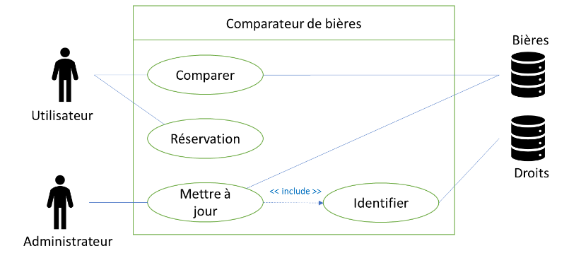
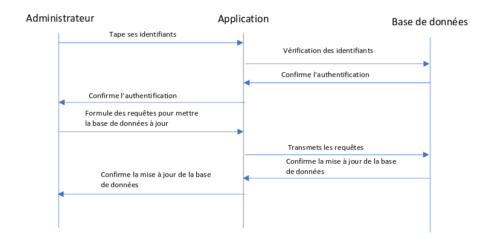
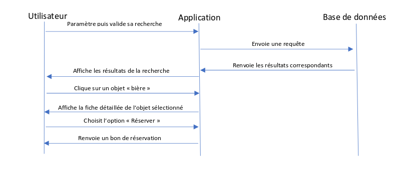
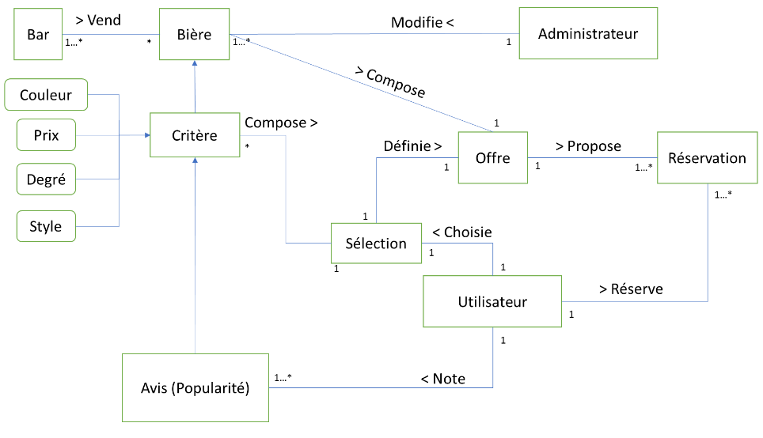

# Projet comparateur de bières

## Présentation

L’application que nous allons développer sera un comparateur de bières. Ce comparateur proposera une offre de bières selon une sélection de critères spécifiés par l'utilisateur qui correspondent le mieux à ses attentes. Nous avons opté pour ce choix car il existe énormément de bières différentes et il serait intéressant pour nous comme pour un utilisateur de s’y retrouver. Il sera également possible de commander chaque bière et de trouver les bars sur Marseille qui les proposent à leur carte. C’est sur ce dernier pointque l’on pense se différencier de la concurrence. Il sera donc très facile de remplir notre base de données. C’est un domaine que nous connaissons assez bien, nous ne serons donc pas perdus !

Nous avons donc étudié ce qui se fait de mieux en termes de sites web.
Les sites qui nous ont intéressés sont :

- [1001 bières](www.1001-bières.fr)

 Ce comparateur de bières (qui n’en comporte que 851), seul deux
 critères sont pris en compte (type de bières et fermentation).

- [Saveur bière](www.saveur-biere.com)

 Ce comparateur se rapproche de ce que nous voulons faire avec un
 design différent parce que notre sélection de critères se
 situera sur un panneau latéral et non horizontal.

- [Le guide](www.leguide.com/bières)

 Comparateur sur beaucoup de produits, notamment les bières.

Nous allons nous baser sur ces critères :

- Style (de Noël, fruitée, sans alcool, de Garde ...),
- Couleur (Ambrée, Blanche, Blonde, Brune ...),
- Pays (France pour l’instant),
- Degré d’alcool,
- Marque
- Bar proposant la bière à sa carte (Marseille pour l’instant),
- Avis, Popularité,
- Prix.

Si nous avons suffisamment de temps il sera possible de situer les bars sur une carte.Nous aimerions aussi concevoir une gestion de compte utilisateur pour que les utilisateurs puissent commenter leur notation et pour faciliter la réservation de plusieurs produits simultanément. Pour atteindre nos objectifs et ne pas s’éparpiller sur un trop grand volume de données, nous nous restreindrons sur les bières fabriquées en France et les bars localisés à Marseille.

Notre application s’appuiera sur une base de données, une interface graphique et le comparateur. Il y aura également a possibilité de noter les bières ce qui permettra d’avoir une tendance sur l’appréciation du produit. Si nous avons suffisamment de temps il sera possible de situer les bars sur une carte. Nous aimerions aussi concevoir une gestion de compte utilisateur pour que les utilisateurs puissent commenter leur notation et pour faciliter la réservation de plusieurs produits simultanément. Pour atteindre nos objectifs et ne pas s’éparpiller sur un trop grand volume de données, nous nous restreindrons sur les bières fabriquées en France et les bars localisés à Marseille.

## Diagramme de cas d'utilisation

## Diagramme de séquence

**Scénarios :**
- Rechercher une bière particulière
- Réserver une bière
- Modifier les attributs d’une bière

**Recherche :**
1. L’utilisateur est sur la page d’accueil de l’application, il effectue une recherche à partir des critères qui l’intéressent (degré d’alcool, couleur, etc..).
2. L’application envoie la requête à la base de données.
3. La base de données renvoie par ordre décroissant les bières les plus pertinentes selon la recherche de l’utilisateur.
4. Elles sont ensuite affichées sur l’IHM. Réservation après recherche (voir diagramme 1).
5. L’utilisateur parcourt la liste des résultats et clique sur celle
qui l’intéresse.
6. Il en repère une qui l’intéresse et clique sur « réservation ».
7. L’utilisateur choisit l’option qui lui convient.
8. L’application prend en compte la réservation si la réservation de ce type de bière est possible et renvoie un bon de réservation.

**Mise à jour :**
1. L’administrateur tape ses identifiants.
2. L’application demande à la base de données de vérifier les identifiants.
3. La base de données confirme l’authentification.
4. L’administrateur met à jour la base données grâce à l’application

## Modèle de domaine

Lors de son accès à notre application, l’utilisateur a le choix de choisir un ou plusieurs critères de sélection pour avoir un classement des bières répondant le plus à son besoin. Après validation, l’application a pour but de lui proposer une offre sous forme de classement des bières les plus pertinentes à sa demande. Dans ce classement, il peut sélectionner chaque objet pour le noter ou le réserver.

